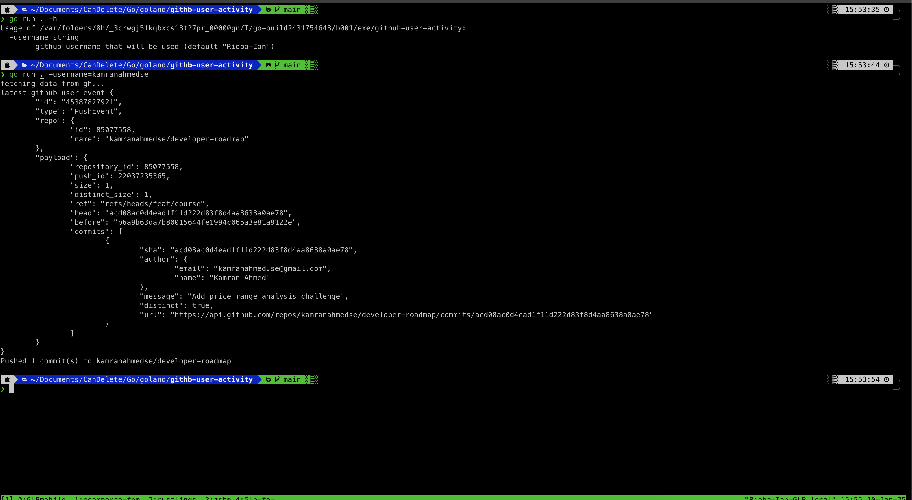

# Github CLI application for Recent Activity Events

## Description

This is a CLI application that uses the Github API to fetch recent activity events for a user. By inputting a Github username, the application will fetch the user's recent activity events and display them in a simple text.

Example:

```sh
❯ go run . -username=kamranahmedse
```

Results

```text
fetching data from gh...
 latest github user event {
        "id": "45387827921",
        "type": "PushEvent",
        "repo": {
                "id": 85077558,
                "name": "kamranahmedse/developer-roadmap"
        },
        "payload": {
                "repository_id": 85077558,
                "push_id": 22037235365,
                "size": 1,
                "distinct_size": 1,
                "ref": "refs/heads/feat/course",
                "head": "acd08ac0d4ead1f11d222d83f8d4aa8638a0ae78",
                "before": "b6a9b63da7b80015644fe1994c065a3e81a9122e",
                "commits": [
                        {
                                "sha": "acd08ac0d4ead1f11d222d83f8d4aa8638a0ae78",
                                "author": {
                                        "email": "kamranahmed.se@gmail.com",
                                        "name": "Kamran Ahmed"
                                },
                                "message": "Add price range analysis challenge",
                                "distinct": true,
                                "url": "https://api.github.com/repos/kamranahmedse/developer-roadmap/commits/acd08ac0d4ead1f11d222d83f8d4aa8638a0ae78"
                        }
                ]
        }
}
Pushed 1 commit(s) to kamranahmedse/developer-roadmap
```

## Demo



## Coverage

The activities covered from github events api so far are:

1. PushEvent
2. PullRequestEvent
3. IssuesEvent
4. IssueCommentEvent
5. WatchhEvent
